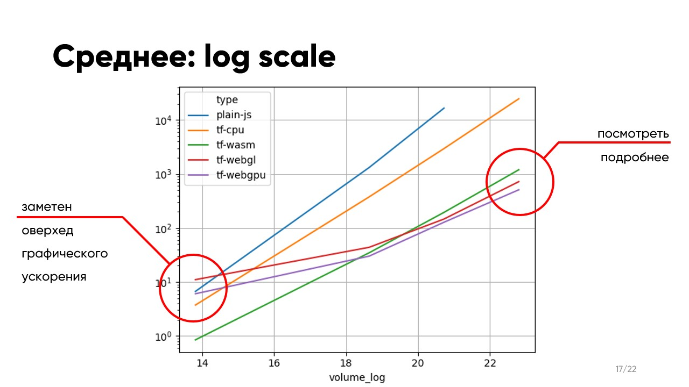

# Compute-Intensive Tasks in the Browser

A BSc thesis (MIPT, 2023) investigating **when to use which browser technology** for heavy computational workloads — Web Workers, WebAssembly, WebGL, and WebGPU. Produces a decision-guide recommendation backed by benchmarks with statistical-significance testing.

## The question

If you have to run heavy compute in a web page — neural-network inference, image processing, simulation — which technology should you use? The answer isn't obvious: each option has setup overhead, browser-support gaps, and crossover points where another technology becomes faster.

## The setup

Benchmark task: **matrix multiplication**, scaled across input volumes from ~10⁴ to ~10¹⁰ elements. Five execution stacks compared:

| Stack | What it tests |
| --- | --- |
| `plain-js` | Unaccelerated JavaScript baseline |
| `tf-cpu` | TensorFlow.js with its default CPU backend |
| `tf-wasm` | TensorFlow.js compiled to WebAssembly (CPU, near-native) |
| `tf-webgl` | TensorFlow.js on the GPU via WebGL shaders |
| `tf-webgpu` | TensorFlow.js on the modern WebGPU API |

Built a React + Vite + TF.js web app (`web-perf/`) so each measurement could be re-run interactively with configurable matrix dimensions and trial counts. Results dumped as JSON (`results/`) and analyzed in `main_research.ipynb` with pandas, matplotlib, and scipy.stats.

## Findings

- **Plain JS and TF.js's CPU backend don't scale.** Both grow exponentially past ~10⁶ elements; unusable for serious workloads.
- **All three accelerated backends scale comparably**, but with a clear ordering at large volumes: **WebGPU > WebGL > WebAssembly**.
- **GPU acceleration overhead matters at small inputs.** Below ~10⁸ elements, WASM is often faster than WebGL/WebGPU because the GPU setup cost dominates the actual work.
- **The WebGL vs WebGPU gap is statistically significant.** Shapiro-Wilk rejected normality, so the comparison used non-parametric **Mann-Whitney U** and **Wilcoxon rank-sum** tests; both confirmed the difference at p < 0.05.

Browser support is the other half of the story: Chromium-family browsers (62% mobile, 77% desktop share at the time of writing) supported everything; Safari (27% / 12%) was the consistent gap on Web Workers, idle callbacks, and stable performance for compute workloads.

## Recommendations

1. **Use WebGPU for large computations.**
2. **For smaller workloads, try WebAssembly** — GPU setup cost can dominate at low input volumes.
3. **Move heavy work to Web Workers** so the main thread stays responsive regardless of which compute backend you pick.

## What's in this repo

- **`main_research.ipynb`** — full analysis: data loading, comparison plots, statistical tests
- **`web-perf/`** — the benchmark web app (React 18, Vite, TF.js with WASM + WebGPU backends, MUI Joy)
- **`results/`** — raw benchmark output as JSON, organized by `<matrix_size>_<backend>_<trial_count>.json`
- **`vendor_research/`** — browser and device-vendor market-share analysis, with its own notebook
- **`data/`, `slides/`** — supporting CSVs and reference images

## Context

Defended as my BSc thesis at MIPT in 2023. The work that pulled me toward browser-performance problems became the foundation for what I do now — frontend engineering on video streaming players, where the same constraints (variable hardware, cross-browser inconsistency, heavy compute alongside a 60-fps UI) define the job.
